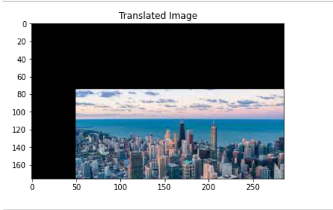
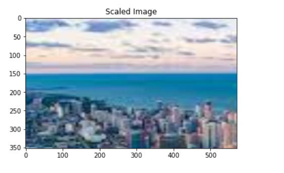
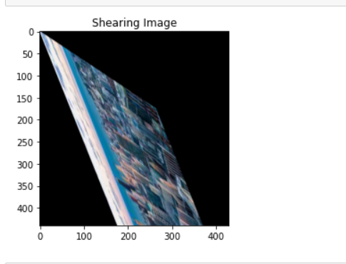
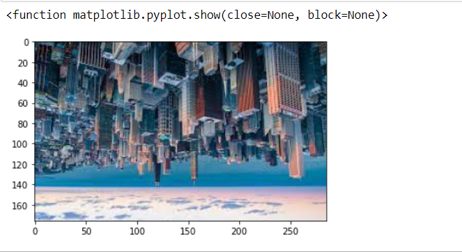
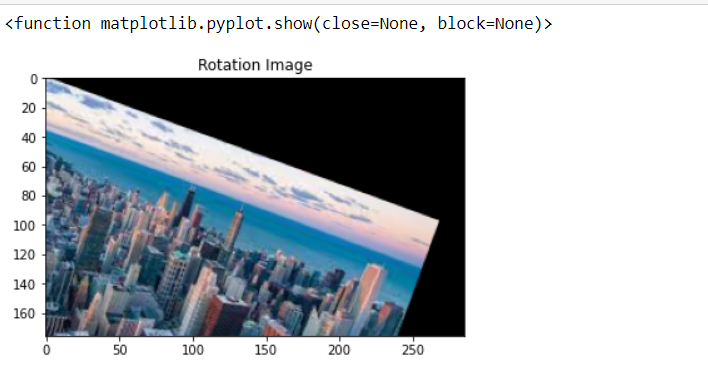
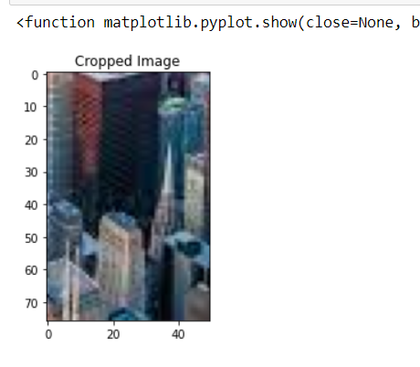

# Image-Transformation
## Aim
To perform image transformation such as Translation, Scaling, Shearing, Reflection, Rotation and Cropping using OpenCV and Python.

## Software Required:
Anaconda - Python 3.7

## Algorithm:
### Step 1:
Import the necessary libraries and read the original image and save it as a image variable.

### Step 2:
Translate the image.

### Step 3:
Scale the image.

### Step 4:
Shear the image.

### Step 5:
Reflect of image.

### Step 6:
Rotate the image.

### Step 7:
Crop the image.

### Step 8:
Display all the Transformed images.
## Program:
~~~
Developed By: ANISH M J
Register Number: 212221230005
~~~
~~~

# To show the original image and to find the shape of the image

import numpy as np
import cv2
import matplotlib.pyplot as plt
img = cv2.imread('city.jpeg')
plt.imshow(img)
plt.show()

img = cv2.cvtColor(img,cv2.COLOR_BGR2RGB)
plt.imshow(img)
plt.show()

rows,cols,dim = img.shape

i)Image Translation

M = np.float32([[1,0,50], [0,1,75],[0,0,1]])
translated_image = cv2.warpPerspective(img,M,(cols,rows))
plt.title("Translated Image")
plt.imshow(translated_image)
plt.show()

ii) Image Scaling
## Scaling

rows,cols,dim = img.shape
M = np.float32([[5.8,0,0],
               [0,4.5,0],
                [0,0,1]])
scaled_img = cv2.warpPerspective(img,M,(cols*2,rows*2))
plt.title("Scaled Image")
plt.imshow(scaled_img)
plt.show()

iii)Image shearing

## IMAGE SHEARING

M = np.float32([[1,1.5,0],
               [2.5,1,0],
               [0,0,1]])
shearing_img = cv2.warpPerspective(img,M,(int(cols*1.5),int(rows*2.5)))
plt.title("Shearing Image")
plt.imshow(shearing_img)
plt.show()

iv)Image Reflection
M = np.float32([[1,0,0],[0,-1,rows],[0,0,1]])
M_y = np.float32([[1,0,cols],[0,-1,rows],[0,0,1]])
ref_img = cv2.warpPerspective(img,M,(int(cols),int(rows)))
refy_img = cv2.warpPerspective(img,M_y,(int(cols),int(rows)))
plt.imshow(ref_img)
cv2.imshow('reflected_y',refy_img)
cv2.waitKey(0)
cv2.destroyAllWindows()

v)Image Rotation
## image rotation

angle = np.radians(20)
M = np.float32([[np.cos(angle),-(np.sin(angle)),0],
               [np.sin(angle), np.cos(angle), 0],
               [0,0,1]])

rotated_img = cv2.warpPerspective(img,M,(int(cols),int(rows)))

plt.title("Rotation Image")
plt.imshow(rotated_img)
plt.show

vi)Image Cropping

cropped_img = img[100:300,150:200]
plt.title("Cropped Image")
plt.imshow(cropped_img)
plt.show

~~~
## Output:
### i)Image Translation

### ii) Image Scaling

### iii)Image shearing

### iv)Image Reflection

### v)Image Rotation

### vi)Image Cropping

## Result: 

Thus the different image transformations such as Translation, Scaling, Shearing, Reflection, Rotation and Cropping are done using OpenCV and python programming.
